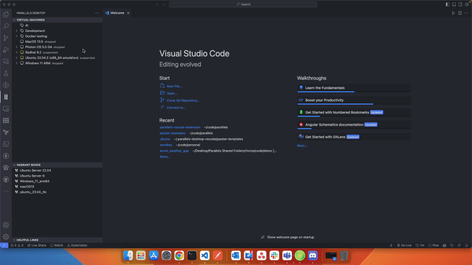
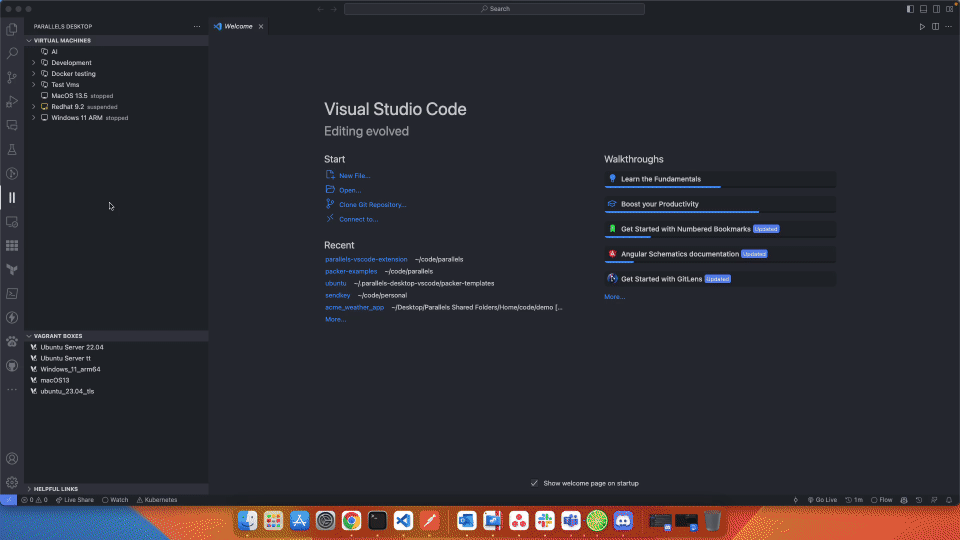
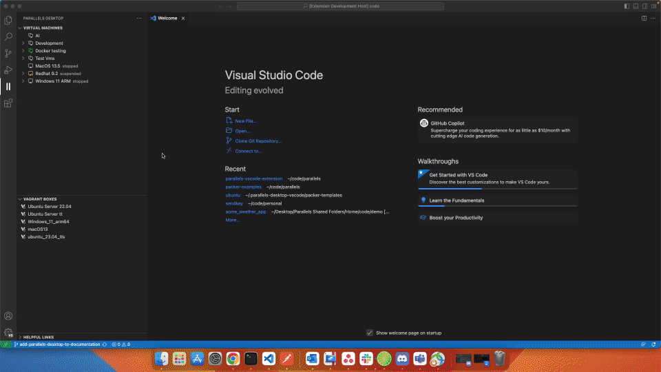
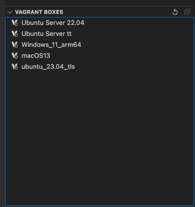

# Visual Studio Code extension for Parallels Desktop

 

This extension allows you to manage a wide range of operations for your Parallels Desktop virtual machines, creating, grouping, operating their snapshots and containers. It is integrated with HashiCorp Vagrant and Packer to automate your workflows.

> **Attention** For some of the functionalities to work, you need to have Parallels Desktop Pro or Business Edition installed on your Mac.
> 
## Community

  
Join our [Discord server](https://discord.gg/n5XVf3Wr6G) to ask questions, share
your experience, and get help from the community.

## Features

### Grouping Virtual Machines

Groups allow a better management of your virtual machines list, you can create groups, rename them, start/stop all machines in a group and create group snapshots. 

Main features:

* Create groups of your virtual machines
* Create group snapshots
* Start, stop, pause, suspend all virtual machines in the group 
* Visual Cue for machines state in groups

### Managing Virtual Machine Lifecycle

Know instantly what is the state of your virtual machines, start, stop, pause, and suspend.

Main features:

* Start, stop, pause, suspend your virtual machines
* Visual Cue for machine state
* Show IP Address of the machine if it is available

### Managing Virtual Machine Snapshots

Create, restore and delete virtual machine snapshots in a compact design.

Main features:

* Create a snapshot
* Restore machine to a snapshot
* Delete a snapshot
* Visual Cue of snapshot tree

### Creating Virtual Machines

Quickly create a new virtual machine. You can choose from a wide range of operating systems that you can install and customize the virtual machine to your needs.

Main features:

* Adding new custom virtual machines
* Select from the list of installation images, open sourced for future expansion by Parallels and community
* Use you own ISO and IPSW files to create a new virtual machine
* Use "Addons" to preinstalled applications into your new virtual machines

### Managing Docker Containers inside Virtual Machines

Manage and create Docker containers inside your virtual machines, without the need to open another window.

Main features:

* Create Docker containers from a wide range of images or your own
* Start/Stop Docker containers
* Remove Docker containers
* Visual Cue for container state
* List all Docker images
* Remove Docker images

Note: a virtual machine should be in the running state for this functionality to work.

### Hiding Virtual Machines or Groups

Hide/show virtual machines or groups. Sometimes we don't want to manage and see certain virtual machines in the Visual Studio Code. You can quickly show all hidden items with a click of a button.

### Vagrant Boxes Management

Manage your Vagrant boxes, see all the boxes you have installed, delete them or init a new one.

Main features:

* List all available Vagrant boxes
* Init Vagrant box
* Delete Vagrant box

## Requirements

You will need to be on Apple Mac and own a license of Parallels Desktop Pro or Business Edition, find more information [here](https://www.parallels.com/products/desktop/pro/)

## Extension Settings

This extension contributes the following settings:

* `parallels-desktop.output_path`: Output path for the packer machines.
* `parallels-desktop.prlctl.path`: Path for your Parallels Desktop Command Line installation.
* `parallels-desktop.extension.path`: Path for the extension.
* `parallels-desktop.extension.download.path`: Path for the extension cached downloads.
* `parallels-desktop.hashicorp.vagrant.boxes.path`: Path for the vagrant boxes.
* `parallels-desktop.vagrant.path`: Path for the vagrant tool.
* `parallels-desktop.hashicorp.packer.path`: Path for the packer tool.
* `parallels-desktop.git.path`: Path for the git tool.
* `parallels-desktop.brew.path`: Path for the brew tool.
* `parallels-desktop.extension.refresh.auto`: Auto refresh the virtual machine extension.
* `parallels-desktop.extension.refresh.interval`: Interval for the auto refresh.
* `parallels-desktop.tree.show-hidden-items`: Always show hidden items in the tree view.
* `parallels-desktop.extension.order-items-alphabetically`: Order items alphabetically.
* `parallels-desktop.extension.show-flat-snapshot-tree`: Show flat snapshot tree.
* `parallels-desktop.extension.start-machines-headless-by-default`: Start machines headless by default.

> Tip: The extension will use default values that will work on most cases and it will try to install all of the dependencies

## Support and Community

This extension is in active development, so please refer to our [issue tracker](https://github.com/Parallels/parallels-vscode-extension/issues) for known issues, and please contribute with additional information if you encounter an issue yourself.

We welcome you to the channel on [Discord server](https://discord.gg/5V5mnNGKQX) to discuss improvements you like to see or simply hangout with other developers using Parallels.

## Contribute

If you're interested in contributing, or want to explore the source code of this extension yourself, see our [contributing guide](CONTRIBUTING.md), which includes:

* [Prerequisites for running and testing code](CONTRIBUTING.md#prerequisites-for-running-and-testing-code)
* [Submitting a pull request](CONTRIBUTING.md#submitting-a-pull-request)
* [Dev loop & Testing changes](CONTRIBUTING.md#dev-loop-testing-changes)
* [Npm Commands](CONTRIBUTING.md#npm-commands)
* [Build](CONTRIBUTING.md#build)
* [Run Tests](CONTRIBUTING.md#run-tests)

## Trademarks Notice

Parallels and the Parallels logo are trademarks or registered trademarks of Parallels International GmbH in Canada, the U.S., and/or elsewhere.
Apple, Mac, and macOS are trademarks of Apple Inc.
Microsoft and Windows are registered trademarks of Microsoft Corporation.
All other company, product and service names, logos, brands and any registered or unregistered trademarks mentioned are used for identification purposes only and remain the exclusive property of their respective owners. Use of any brands, names, logos or any other information, imagery or materials pertaining to a third party does not imply endorsement. We disclaim any proprietary interest in such third-party information, imagery, materials, marks and names of others.
