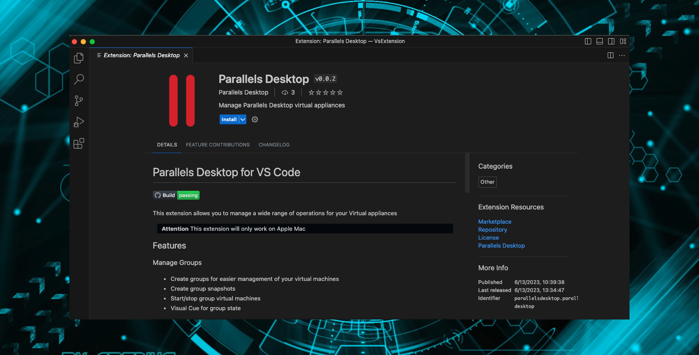
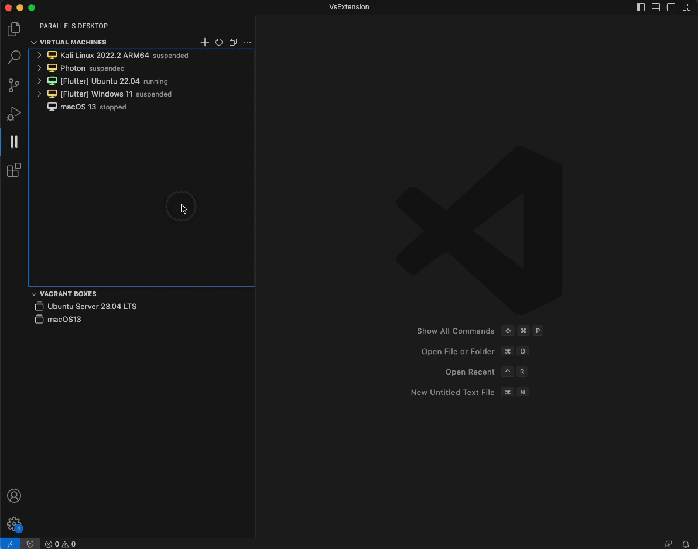
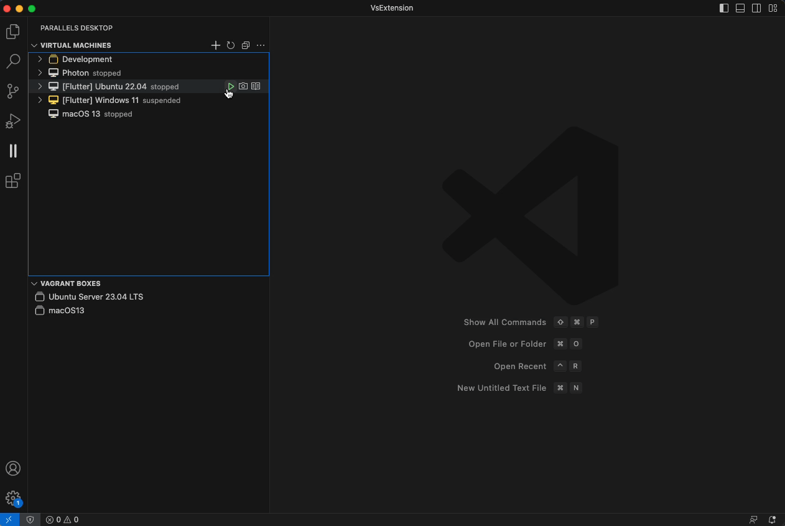
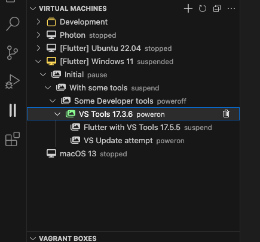
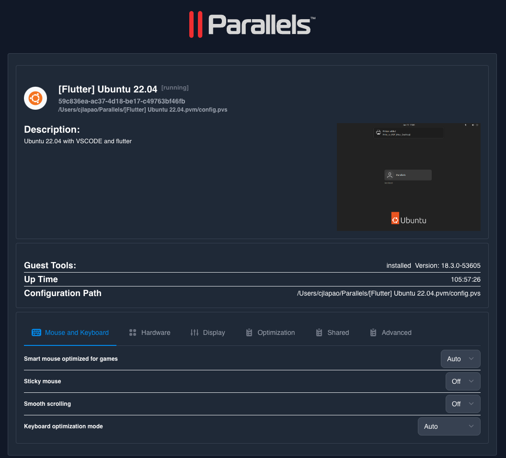
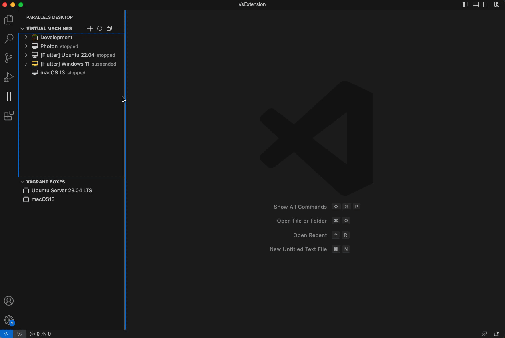
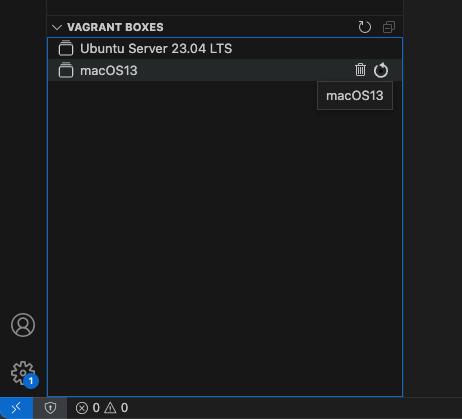

# Parallels Desktop for VS Code

 

This extension allows you to manage a wide range of operations for your Virtual appliances

> **Attention** This extension will only work on Apple Mac

## Features

### Manage Groups

* Create groups for easier management of your virtual machines
* Create group snapshots
* Rename groups
* Start/stop group virtual machines
* Visual Cue for group state

### Manage Virtual Machine states

* Start Machines
* Stop Machines
* Pause Machines
* Suspend Machines
* Show current state of Machines
* Take snapshot of a Machine

### Manage Machine Snapshots

* Create a snapshot
* Restore machine to a snapshot
* Delete a snapshot
* Visual Cue of snapshot tree

### Virtual Machine Details

* Show Virtual Machine details
* Change Machine Settings

### Creating Virtual Machines

* Adding new custom Virtual Machines
* Use "Addons" to get pre installed applications
* Wide range of appliances and growing
* Open source for community expansion

### Vagrant Boxes Management

* List all available Vagrant Boxes
* Init Vagrant Box
* Delete Vagrant Box

## Requirements

You will need to be on Apple Mac and own a license of Parallels Desktop Pro or Business Edition, find more information [here](https://www.parallels.com/uk/products/desktop/pro/)

## Extension Settings

This extension contributes the following settings:

* `parallels-desktop.output_path`: Output path for the packer machines.
* `parallels-desktop.path`: Path for your Parallels Desktop installation.
* `parallels-desktop.downloadFolder`: Download folder for any Iso/IPSW that requires downloading.
* `parallels-desktop.vagrant.path`: Path for the vagrant tool.
* `parallels-desktop.hashicorp.packer.path`: Path for the packer tool.

> Tip: The extension will use default values that will work on most cases and it will try to install all of the dependencies

## Issues

This extension is still in development, so please refer to our [issue tracker](https://github.com/Parallels/parallels-vscode-extension/issues) for known issues, and please contribute with additional information if you encounter an issue yourself.

## Contribute

If you're interested in contributing, or want to explore the source code of this extension yourself, see our [contributing guide](CONTRIBUTING.md), which includes:

* [Prerequisites for running and testing code](CONTRIBUTING.md#prerequisites-for-running-and-testing-code)
* [Submitting a pull request](CONTRIBUTING.md#submitting-a-pull-request)
* [Dev loop & Testing changes](CONTRIBUTING.md#dev-loop-testing-changes)
* [Npm Commands](CONTRIBUTING.md#npm-commands)
* [Build](CONTRIBUTING.md#build)
* [Run Tests](CONTRIBUTING.md#run-tests)
